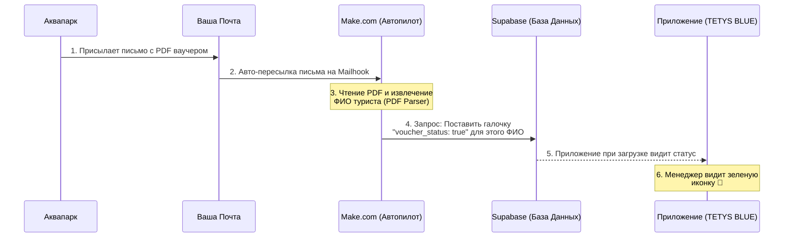
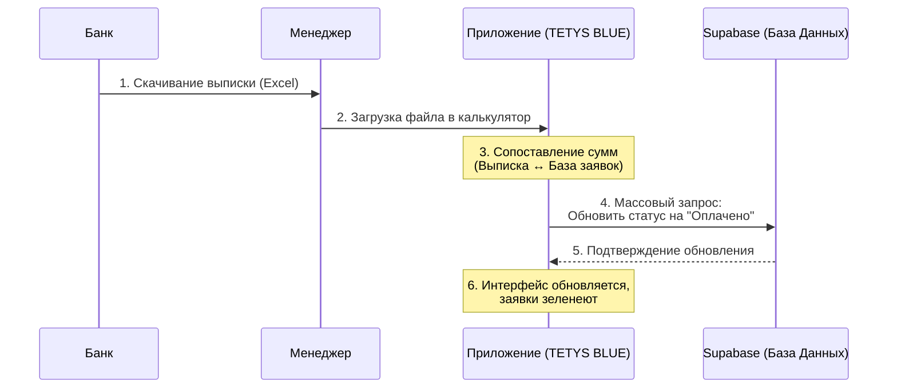

# Схема работы: Автопилот ваучеров и Сверка с банком

Здесь наглядно показано, как разные части системы общаются между собой без участия человека. 

## 1. Автопилот Ваучеров (Make.com)

Этот процесс полностью автоматизирует появление зеленой иконки 🎫 в приложении сразу после того, как аквапарк присылает готовый ваучер.

**Принцип работы (по шагам):**
1. **Аквапарк** выпускает ваучер и отправляет его на вашу рабочую почту.
2. Ваша **Почта** видит, что письмо от аквапарка (и с вложением), и, благодаря правилу от сисадмина, мгновенно пересылает его в **Make.com**.
3. **Make.com** ловит письмо, берет PDF-вложение и "читает" его, находя нужную строчку с именем туриста (например, *Ivanov Ivan*).
4. **Make.com** по секретному ключу (API key) стучится в вашу базу данных **Supabase** и говорит: *"Найди туриста Ivanov Ivan и переключи ему рубильник voucher_status в положение Включено (true)"*.
5. В это время ваше **Приложение** (которое постоянно берет данные из Supabase) видит, что рубильник включен.
6. В интерфейсе приложения напротив заявки Иванова моментально рисуется зеленый значок 🎫.

---

## 2. Автоматическая Сверка с Банком

Этот процесс избавляет менеджера от ручного поиска и проставления статуса "Оплачено" каждой заявке.

**Принцип работы (по шагам):**
1. **Банк** формирует выписку за день (файл Excel), которую **Менеджер** скачивает на компьютер.
2. **Менеджер** нажимает кнопку "Сверка с банком" в приложении и загружает этот Excel файл.
3. **Приложение** (прямо внутри браузера) читает Excel и начинает искать совпадения: берет сумму из банка и ищет точно такую же сумму в заявках за этот день.
4. Когда совпадения найдены, приложение собирает ID всех "успешных" заявок и отправляет команду в базу **Supabase**: *"Переведи статус этих 15 заявок в Оплачено"*.
5. **Supabase** обновляет записи у себя и сообщает приложению, что всё готово.
6. **Приложение** перерисовывает таблицу — заявки перекрашиваются в зелёный цвет, цифры выручки обновляются, а менеджер получает красивый финальный отчет о том, что сошлось, а что нет.
